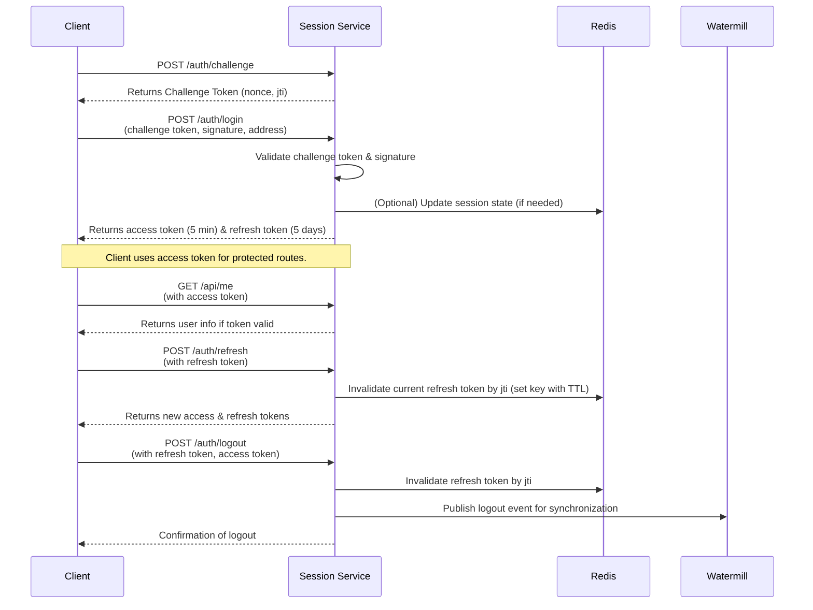

# Barong Session Service

This repository implements a session management service called barong in Go using the Gin framework, Watermill Redis for event publishing, and JWT tokens signed with ES256. It supports challenge–response authentication using Ethereum signatures (EIP‑712 style), access/refresh token issuance with rotation, and refresh token invalidation via Redis. Refresh tokens are valid for 5 days and access tokens for 5 minutes. Each refresh token is identified by a unique `jti` so that sessions on different devices or browsers can be invalidated independently.

## Entities

The entities are types containing state and behavior, each JWT is repressented by a Token,
A Session is composed of 2 tokens: Challenge and Refresh.

- struct Token will represent 1 jwt token which use `eth.Signer` and `jwt.Claims`
- struct Session will represent a session and holds 2 Tokens (Challenge and refresh)

## Dependencies

- github.com/layer-3/barong/internal/eth
- github.com/redis/go-redis/v9
- github.com/golang-jwt/jwt/v5
- github.com/ThreeDotsLabs/watermill/message
- github.com/gin-gonic/gin
- github.com/google/uuid

## Specifications

- **Challenge Token**
  - **Endpoint:** `POST /auth/challenge`
  - **Description:** Issues a JWT challenge token containing a random `nonce` and a unique identifier (`jti`). Valid for 5 minutes.
  
- **Login**
  - **Endpoint:** `POST /auth/login`
  - **Description:** The client signs the challenge token’s `nonce` with its Ethereum key and submits the challenge token, signature (hex encoded), and Ethereum address. The server validates the challenge token and signature, then issues an access token and a refresh token.
  - **Tokens Issued:**
    - **Access Token:** Valid for 5 minutes.
    - **Refresh Token:** Valid for 5 days.

- **Refresh**
  - **Endpoint:** `POST /auth/refresh`
  - **Description:** The client submits its current refresh token. The server validates it and, if valid, invalidates the old refresh token (using its `jti` stored in Redis) and returns new access and refresh tokens.
  
- **Logout**
  - **Endpoint:** `POST /auth/logout`
  - **Description:** Invalidates the provided refresh token (by marking its `jti` in Redis with a TTL matching its remaining lifetime) and publishes a logout event for cross-instance session synchronization.

- **Protected Endpoints**
  - **GET /api/me:** Returns user information based on the access token.
  - **GET /api/authorize:** Returns 200 if the provided access token is valid.

## File Structure

```
barong/
├── cmd/
│   └── barong/
│       └── main.go         # Application entry point.
│                              - Reads the REDIS_URL from the environment.
│                              - Connects to Redis (using go-redis).
│                              - Creates a Watermill Redis publisher.
│                              - Instantiates and starts the Gin server.
├── errors.go               # Defines common error variables used by the service.
├── interface.go            # Defines the public client interface for interacting with the session package.
├── service.go              # Implements HTTP handlers (login, refresh, logout, protected endpoints) and publishes events.
├── session.go              # Provides the Session abstraction that encapsulates access/refresh token logic,
│                              including validation, rotation, and invalidation via Redis (by token jti).
└── token.go                # Contains type Token and all low-level JWT creation and parsing logic (challenge, access, refresh tokens).
```

- **token.go:**
  Contains the Token entity, and define 3 claims, NewToken(address string, TokenType, eth.Signer), the token will know it's type from the Claims it receives.
  Token object should be generic and can be either one of the token type by passing or registering the specific claims.
  Handles creation of JWT tokens for challenges, access, and refresh flows. All low-level JWT parsing including error handling related to signing method, claims, etc.
  Note: Do not generate a constructor for each Token Type only use NewToken

- **errors.go:**  
  Contains all the errors used across the package (e.g., token expiration, invalid signature, unexpected signing method).

- **session.go:**  
  Implements a `Session` struct that:
  - Define Session entity, represent the lifecycle of a user session by rotating and invalidating tokens.
  - Rotates refresh tokens by invalidating the old one in Redis (using its `jti` with a TTL equal to the token’s remaining lifetime).
  - Allows multiple sessions per user by invalidating tokens on a per‑jti basis.
  - When verifying a token validate the "aud" claim belong to the correct token type
  - Contains the 2 tokens that compose a session, challenge, refresh creating a higher level abstraction for service.go
  - Generate the access tokens

- **service.go:**  
  Provides the HTTP API endpoints by leveraging the Session. It also integrates with Watermill to publish logout events for cross-instance coordination.

- **interface.go:**  
  (Optional) Defines a `Client` interface that abstracts the session package’s external API, enabling easier testing or integration.
  Define a Store interface for storing refresh jti, `Store` interface are described below.

- **redis_store.go:**
  Must implement Store taking a context in the constructor

- **memory_store.go:**
  Should implement Store with a simple map for test purposes, we can ignore TTL

- **cmd/barong/main.go:**  
  Wires up the entire service by:
  - Reading the Redis connection URL from the environment.
  - Initializing the Redis client and Watermill publisher.
  - Generating (or loading) the ES256 signing key.
  - Starting the Gin router with the defined endpoints.

## Token Descriptions

- **Challenge Token:**
  - **Claims:**
    - `aud`: `"session:challenge"`.
    - `sub`: User's Ethereum address.
    - `jti`: Unique token identifier.
    - `exp`: Expiration time (5 minutes after issuance).
    - `nonce`: A random string to be signed by the client.

- **Access Token:**
  - **Claims:**
    - `aud`: `"session:access"`.
    - `sub`: User's Ethereum address.
    - `iat`: Issued-at timestamp.
    - `exp`: Expiration time (5 minutes after issuance).
    - `jti`: Unique token identifier.
    - `rid`: Refresh token jti

- **Refresh Token:**
  - **Claims:**
    - `aud`: `"session:refresh"`.
    - `sub`: User's Ethereum address.
    - `iat`: Issued-at timestamp.
    - `exp`: Expiration time (5 days after issuance).
    - `jti`: Unique token identifier.
  - **Invalidation:**  
    When a refresh token is used for rotation or logout, its `jti` is stored in Redis with a TTL equal to its remaining lifetime so that it is invalidated across all sessions.

## Interfaces

The session package exposes a `Client` interface (defined in `interface.go`) that might look like:

```go
type Client interface {
    // Challenge returns a challenge token.
    Challenge() (challenge Token, err error)
    // Login verifies the challenge token and signature, and returns new tokens.
    Login(challenge Token, signature, address string) (access, refresh Token, err error)
    // Refresh rotates the refresh token and returns new tokens.
    Refresh(refresh Token) (access, refresh Token, err error)
    // Logout invalidates the provided tokens.
    Logout(refresh, access Token) error
}

type Store interface {
  Set(ctx context.Context, key, value string, ttl time.Duration) error
  Get(ctx context.Context, key string) (string, error)
}
```

## Routes Summary

| **Method** | **Endpoint**         | **Description**                                                   |
|------------|----------------------|-------------------------------------------------------------------|
| POST       | /auth/challenge      | Issue a challenge token (nonce + jti, valid for 5 minutes).       |
| POST       | /auth/login          | Verify challenge token and signature; issue access & refresh tokens. |
| POST       | /auth/refresh        | Rotate refresh token; issue new access & refresh tokens.          |
| POST       | /auth/logout         | Invalidate refresh token and publish logout event.                |
| GET        | /api/me              | Return user info based on access token claims.                    |
| GET        | /api/authorize       | Validate access token and confirm authorization.                  |

## Mermaid Sequence Diagram

Below is a Mermaid diagram that shows the high-level authentication flow:


